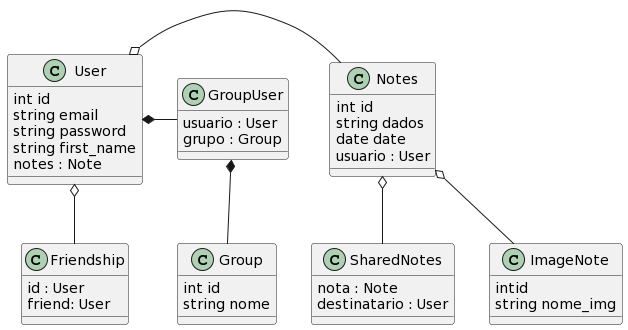

 Projeto do bloco de notas
 

 Feito usando as seguintes tecnologias: python, flask, sqlalchemy, jinja. 
  
 Abaixo segue um diagrama básico de classe, feito com a seguinte ferramenta: https://www.planttext.com/
  
 

